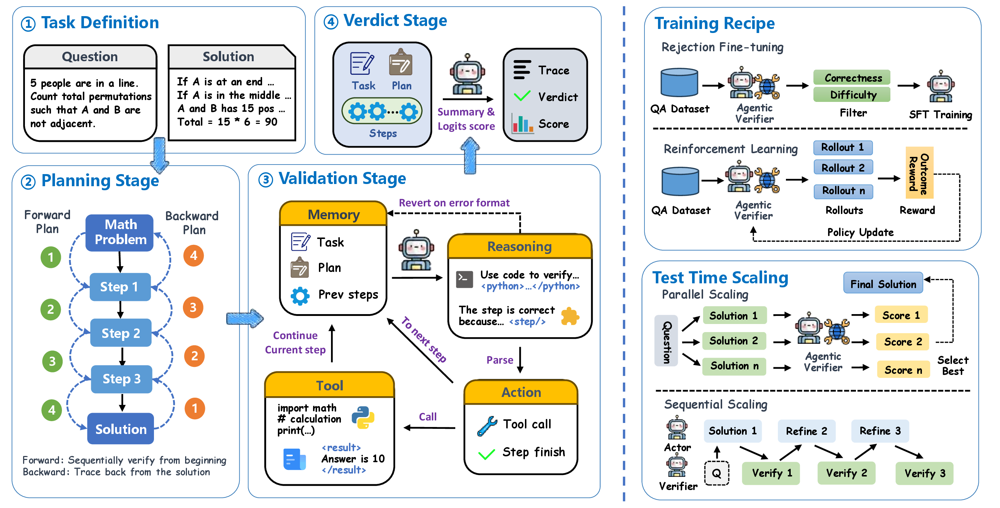

<div align="center">

# AgentV-RL: Scaling Reward Modeling with Agentic Verifier

<p>
<a href="#updates">Updates</a> |
<a href="#main-results">Results</a> |
<a href="#getting-started">Getting Started</a> |
<a href="#citation">Citation</a>
</p>

</div>

<p align="center">
  
</p>

## Overview

AgentV-RL is an open-source recipe for scaling reward modeling with an agentic verifier. Our method turns verification into a multi-turn process with explicit planning, stepwise validation, final verdict aggregation, and tool use, and applies it to both Best-of-N reranking and iterative refinement. In benchmark evaluations, AgentV-RL delivers strong gains on mathematical reasoning tasks, reaching 79.0 on MATH500, 93.3 on GSM8K, 57.4 on Gaokao2023, and 53.3 on AIME24 under BoN@128 with the 4B verifier.

This work is done by collaborators from Fudan University, Huazhong University of Science and Technology, The University of Hong Kong, and ByteDance Seed. Our training and evaluation codebase is built on Verl. This repository includes the core inference, refinement, SFT, and GRPO training code for the AgentV-RL pipeline.


## Main Results

We evaluate AgentV-RL under two test-time scaling settings: **parallel TTS** with Best-of-N selection, and **sequential TTS** with iterative refinement.

### Parallel TTS: Best-of-N

Accuracy of the AgentV-RL 4B verifier under different BoN budgets:

| Benchmark | BoN@32 | BoN@64 | BoN@128 |
| --- | ---: | ---: | ---: |
| MATH500 | 73.8 | 76.2 | 79.0 |
| GSM8K | 93.0 | 92.6 | 93.3 |
| Gaokao2023 | 54.5 | 55.1 | 57.4 |
| AIME24 | 46.7 | 50.0 | 53.3 |

On MATH500, the paper reports up to **25.2** absolute points improvement over prior outcome-level reward model baselines.

### Sequential TTS: Iterative Refinement

Accuracy of the AgentV-RL 4B verifier when used as the critique module in multi-round refinement:

| Benchmark | Turn 1 | Turn 2 | Turn 3 |
| --- | ---: | ---: | ---: |
| MATH500 | 84.2 | 89.2 | 89.8 |
| GSM8K | 94.6 | 94.1 | 94.1 |
| Gaokao2023 | 75.6 | 76.6 | 76.4 |
| AIME24 | 40.0 | 33.3 | 33.0 |

Most of the gain is obtained in the first one or two refinement rounds, with later rounds mainly stabilizing performance on the easier benchmarks.


## Repository Structure

```text
Agentic-Verfifier/
├── README.md
├── requirements.txt
├── config/
│   ├── default.yml
│   └── score_vanilla.yml
├── examples/
│   ├── run_verify.sh
│   ├── run_verify_entry.sh
│   ├── run_refine.sh
│   ├── run_refine_entry.sh
│   ├── score_vanilla_infer.sh
│   ├── train_sft_multiturn.sh
│   └── train_grpo.sh
└── src/
    ├── run_verify_multihead.py
    ├── score_vanilla_infer.py
    ├── refine/
    ├── agentflow/
    └── verl/
```

Important entrypoints:

- `src/run_verify_multihead.py`: agentic Best-of-N verification
- `src/refine/main_refine.py`: iterative refinement
- `src/score_vanilla_infer.py`: vanilla single-pass verifier baseline
- `examples/train_sft_multiturn.sh`: multiturn SFT
- `examples/train_grpo.sh`: GRPO training

## Installation

```bash
pip install -r requirements.txt
export PYTHONPATH="$(pwd)/src:${PYTHONPATH}"
```


## Getting Started

### Best-of-N Verification

```bash
bash examples/run_verify_entry.sh \
  --task-name math500 \
  --exp-name qwen3_4b_agentic \
  --config config/default.yml \
  --model-path /path/to/verifier-model \
  --input /path/to/bon_input.jsonl \
  --output-dir /path/to/output \
  --log-dir /path/to/logs \
  --num-workers 4 \
  --enable-thinking
```

### Vanilla Verifier Baseline

```bash
python src/score_vanilla_infer.py \
  --config config/score_vanilla.yml \
  --input /path/to/bon_input.jsonl \
  --output /path/to/bon_result.jsonl \
  --record-batch-size 1 \
  --append
```

### Iterative Refinement

```bash
bash examples/run_refine_entry.sh \
  --candidate-config config/default.yml \
  --verifier-config config/default.yml \
  --input /path/to/refine_input.jsonl \
  --output /path/to/final.jsonl \
  --round-output-dir /path/to/round_outputs \
  --metrics-output-dir /path/to/metrics \
  --exp-name refine_qwen3 \
  --verifier-type forward \
  --candidate-model-path /path/to/candidate-model \
  --verifier-model-path /path/to/verifier-model \
  --num-candidate-workers 2 \
  --num-verifier-workers 2 \
  --batch-size 16 \
  --max-refine-rounds 3 \
  --thinking-candidate \
  --thinking-verifier
```

### Training

#### Multiturn SFT

```bash
bash examples/train_sft_multiturn.sh
```

#### GRPO

```bash
bash examples/train_grpo.sh
```

## Data Format

### Best-of-N Verification Input

Each JSONL record contains one problem and a fixed candidate pool.

```json
{
  "idx": 0,
  "input": "<prompt text for the candidate model>",
  "question": "<raw question>",
  "answer": "optional reference solution",
  "ground_truth": "(3,\\frac{\\pi}{2})",
  "samples": [
    "candidate answer 0",
    "candidate answer 1"
  ],
  "evaluations": [
    {
      "correct": true,
      "parsed_gt": "(3,\\frac{\\pi}{2})",
      "parsed_pred": "(3,\\frac{\\pi}{2})",
      "mathd_equal": true,
      "sympy_equal": false,
      "sampling_id": 0
    }
  ]
}
```

Notes:

- `samples` and `evaluations` must be aligned by index.
- each evaluation corresponds to exactly one candidate answer.

### Refinement Input

Each JSONL record contains one problem and, optionally, an initial answer.

```json
{
  "idx": 0,
  "input": "<prompt text for the candidate model>",
  "question": "<raw question>",
  "answer": "optional reference solution",
  "ground_truth": "33",
  "refine_rounds": [
    {
      "answer": "<candidate reasoning trace>",
      "cand_correct": false,
      "cand_grade": {
        "parsed_gt": "33",
        "parsed_pred": "13",
        "correct": false,
        "mathd_equal": false,
        "sympy_equal": false
      }
    }
  ]
}
```

If no initial answer is provided, the candidate model generates it in round 0.

### RL Training Input

The GRPO stage expects boolean verifier supervision:

```json
{
  "idx": 708,
  "data_source": "rm_bool",
  "prompt": [
    {"role": "system", "content": "..."},
    {"role": "user", "content": "..."}
  ],
  "reward_model": {
    "ground_truth": true,
    "style": "rule"
  },
  "extra_info": {
    "problem": "<original question>",
    "solution": "<candidate solution>"
  }
}
```

Notes:

- `data_source` must be `rm_bool`.
- the effective training input is built from `extra_info.problem` and `extra_info.solution`.

## Multi-Node Execution

The provided BoN and GRPO scripts support multi-node execution with Ray.

Requirements:

- all machines mount the same shared filesystem;
- each machine runs the same launch script with the same experiment metadata;
- one process becomes the Ray head node and the others join as workers.


## License

This project is released under the license in `LICENSE`.
